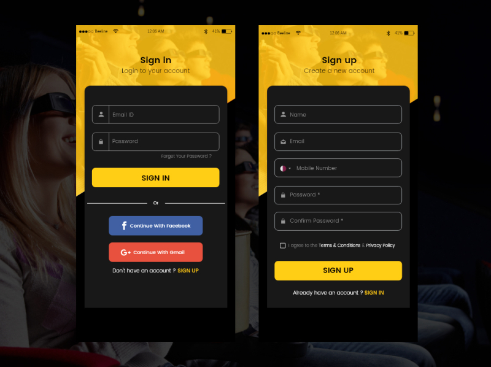

# git tutorial learn

# Sign In/Sign Up System

## Table of Contents
- [git tutorial learn](#git-tutorial-learn)
- [Sign In/Sign Up System](#sign-insign-up-system)
  - [Table of Contents](#table-of-contents)
  - [Introduction](#introduction)
  - [Features](#features)
  - [Requirements](#requirements)
  - [Getting Started](#getting-started)
  - [Usage](#usage)
  - [Configuration](#configuration)
  - [Contributing](#contributing)
  - [License](#license)
  - [first line](# git tutorial learn)
## Introduction

Provide a brief introduction to the Sign In/Sign Up system, explaining its purpose and importance in web or mobile applications.

## Features

List the key features of the system, such as user registration, authentication, password reset, profile management, session management, OAuth2 integration, and email verification.

## Requirements

Outline the prerequisites for using the system, such as Node.js and npm, a database system, and hosting environment.

## Getting Started

Explain the steps to set up the system in a new project:

1. Clone the repository.
2. Install dependencies.
3. Configure the database and environment variables.
4. Start the application.
5. Access the system in a web browser.

## Usage

Provide guidance on how to use and integrate the system into your application, including user registration, sign-in, profile management, password reset, and OAuth2 integration.

## Configuration

Detail how to configure the system for your environment, including creating a `.env` file with necessary environment variables, setting up the database connection, and configuring email services if needed.

## Contributing

Encourage contributions to the project and link to a separate CONTRIBUTING.md file or provide guidelines for contributing.

## License

Specify the project's license (e.g., MIT License) and include a link to the full license text if applicable.

---

Feel free to customize this template to suit your specific project's needs. Ensure that you update the content with accurate information about your Sign In/Sign Up system.
