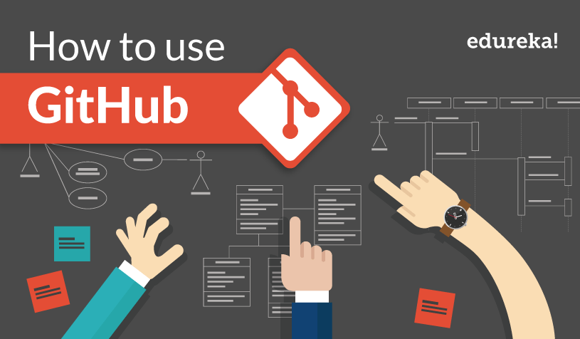

# Git Tutorials

Welcome to the Git Tutorials repository! This project aims to provide comprehensive tutorials and guides to help you understand and master the Git version control system. Whether you're a beginner looking to get started with the basics or an experienced developer seeking advanced Git techniques, you'll find valuable resources here.





## Table of Contents

- [Git Tutorials](#git-tutorials)
  - [Table of Contents](#table-of-contents)
  - [Introduction](#introduction)
  - [Tutorials](#tutorials)
  - [Requirements](#requirements)
  - [Getting Started](#getting-started)

## Introduction

Git is a widely-used distributed version control system that plays a crucial role in modern software development. It allows developers to track changes in their codebase, collaborate with others, and manage project versions efficiently. This repository serves as a central hub for Git tutorials, covering everything from the basics to advanced topics.

## Tutorials

Our Git tutorials cover a wide range of topics, including but not limited to:

- **Git Basics:** Learn the fundamental Git commands and concepts, such as cloning repositories, creating branches, committing changes, and pushing to remote repositories.
  

- **Collaborative Workflows:** Explore Git workflows for team collaboration, including feature branching, pull requests, code reviews, and conflict resolution.
  

- **Advanced Git Techniques:** Dive into more advanced Git features and techniques, such as rebasing, cherry-picking, interactive rebasing, and submodules.
  

- **Git Best Practices:** Discover best practices for Git usage, including commit message conventions, branching strategies, and repository organization.
  

- **Git Integration:** Explore Git integrations with popular development tools and platforms, such as GitHub, GitLab, Bitbucket, and CI/CD pipelines.
  

- **Git Troubleshooting:** Learn how to diagnose and resolve common Git issues, such as merge conflicts, detached HEAD state, and repository maintenance.
  

- **Git Extensions:** Explore powerful Git extensions and tools that enhance your Git workflow and productivity.
  

## Requirements

Before diving into the Git tutorials, ensure you have the following prerequisites:

- [Git](https://git-scm.com/) installed on your local machine.

- A code editor or integrated development environment (IDE) of your choice.

- Basic knowledge of the command line (terminal) for executing Git commands.

## Getting Started

1. **Clone this Repository:**

   Start by cloning this Git Tutorials repository to your local machine:

  ```bash
git clone https://github.com/yourusername/git-tutorials.git
  ``````
